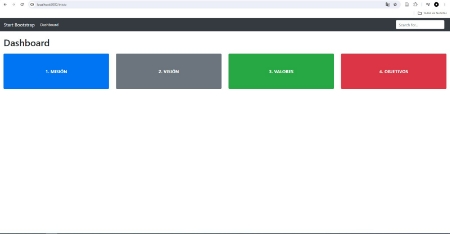
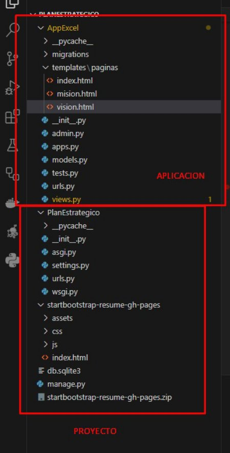
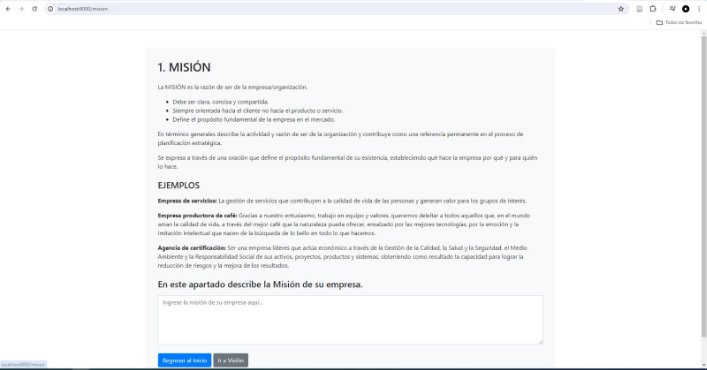
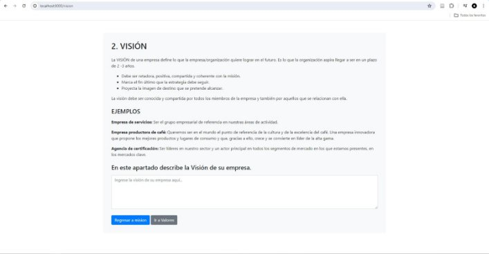
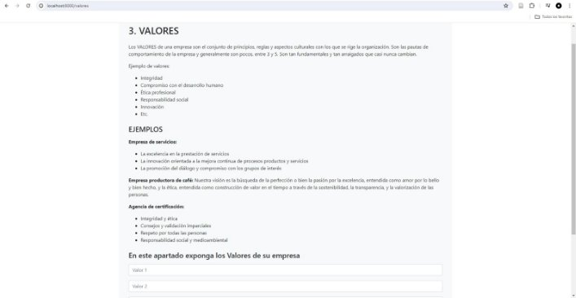



Municipalidad Distrital Crnl. Gregorio Albarracín Lanchipa (MD-CGAL)

Escuela profesional de ingeniería de sistemas SI-886, Planteamiento Estratégico de TI

1. Joel Robert Ccalli Chata, [0009-0002-8833-4621](https://orcid.org/0009-0002-8833-4621)
1. Marjiory Grace Llantay Machaca, [0009-0008-8247-0618](https://orcid.org/0009-0008-8247-0618)
1. Fiorela Milady Ticahuanca Cutipa, [0009-0006-1230-859](https://orcid.org/0009-0006-1230-859X)
1. Edward Mamani Apaza, [0009-0006-1230-859](https://orcid.org/0009-0006-1230-859X)
1. Gerardo Alejandro Concha Llaca, [0009-0006-1230-859](https://orcid.org/0009-0007-5028-6384)

Docente:

[Dr. Oscar J. Jimenez Flores ](https://dina.concytec.gob.pe/appDirectorioCTI/VerDatosInvestigador.do?id_investigador=33398)Resumen: El informe presenta el diseño y desarrollo de un sistema en Python y Orcid: base de datos para la Municipalidad Distrital Crnl. Gregorio Albarracín Lanchipa [0000-0002-7981-8467](https://orcid.org/0000-0002-7981-8467) en Tacna, Perú, con el propósito de gestionar eficientemente el registro de usuarios

y otras actividades administrativas. Este sistema permitirá realizar operaciones Semestre: CRUD de manera intuitiva, mejorando la transparencia y eficiencia en la gestión UPT-EPIS, 2024-I de la información municipal y facilitando la prestación de servicios a la comunidad.

Palabras clave: Municipio, Tacna, Peru, software, Python, base de datos, operaciones CRUD, registro de usuarios, gestión administrativa, transparencia, eficacia, prestación de servicios.

1. Introducción

En el contexto actual de la Municipalidad Distrital Crnl. Gregorio Albarracín Lanchipa (MD-CGAL) en Tacna, Perú, la necesidad de modernizar y optimizar los procesos administrativos es cada vez más evidente. En línea con este objetivo, se plantea la implementación de un sistema informático que permita gestionar de manera eficiente el registro de usuarios y otras actividades generales.

Este informe presenta el diseño y desarrollo de un sistema basado en Python y una base de datos adecuada, que facilitará la creación, lectura, actualización y eliminación (CRUD) de registros de usuarios, así como la gestión de otras tareas administrativas relevantes para la Municipalidad.

La creación de este sistema busca no solo agilizar los procesos internos de la MD-CGAL, sino también mejorar la transparencia, la accesibilidad y la eficiencia en la gestión de la información. Además, se pretende ofrecer una herramienta versátil y fácil de usar para el personal administrativo, contribuyendo así a una mejor prestación de servicios a la comunidad y al fortalecimiento de la gestión municipal en el distrito.

A lo largo de este documento, se detallará el proceso de diseño, desarrollo e implementación del sistema, así como las consideraciones técnicas y funcionales que han guiado su construcción. Se espera que este sistema sea una contribución significativa para mejorar la calidad y eficiencia de las operaciones en la Municipalidad Distrital Crnl. Gregorio Albarracín Lanchipa.

2. Visión

La Municipalidad Distrital Coronel Gregorio Albarracín Lanchipa (MDCGAL) como organismo local promotor del desarrollo de su ámbito tiene como visión el desarrollo integral sostenible, todo ello a través de un mo- delo urbanístico, productivo, turístico y económico planificado con instituciones competitivas y una población capacitada, educada e identificada con su distrito.

3. Misión

Nuestra misión como institución edil es promover e impulsar el desarrollo socio económico y bienestar de la población albarracina, con la presentación de servicios administrativos, impulsando proyectos de infraestructura básica y de apoyo a la producción de autoconsumo; mejorando la calidad de vida de la población y promoviendo la participación de la inversión privada Los esfuerzos del MDGAL se orientan prioritariamente a los ámbitos de extrema pobreza, organizaciones de base y Juntas Vecinales, favoreciendo a los grupos más vulnerables de la población, para crear y garantizar el acceso al empleo productivo que posibilite mejorar sus niveles y calidad de vida. En el corto y mediano plazo, la MDGAL debe constituirse en un municipio piloto y modelo, pionero acorde con la modernización de la administración pública y descentralizada y desconcentración del país; nuevo distrito de frontera, con ganas de desarrollar los servicios básicos y oportunidades; eje distrital con fines de desarrollo.

4. Valores
- Sostenibilidad: Compromiso con el desarrollo equilibrado y responsable, garantizando el bienestar de las generaciones presentes y futuras.
- Planificación: Enfoque estratégico y metódico en la organización y ejecución de proyectos para alcanzar objetivos a largo plazo.
- Competitividad: Fomento de la excelencia y la eficiencia en la gestión municipal, promoviendo la inno- vación y la mejora continua.
- Educación: Valoración del conocimiento y la formación como pilares fundamentales para el desarrollo personal y comunitario.
- Identidad: Respeto y valoración de la cultura y tradiciones locales, promoviendo el arraigo y la perte- nencia a la comunidad.
- Participación: Involucramiento activo de la ciudadanía en la toma de decisiones y la construcción del futuro del distrito.
- Solidaridad: Compromiso con la equidad y la justicia social, priorizando el apoyo a los sectores más vulnerables y necesitados.
- Transparencia: Prácticas claras y abiertas en la gestión pública, garantizando la rendición de cuentas y la confianza ciudadana.
- Innovación: Adopción de nuevas ideas y tecnologías para resolver problemas y mejorar la calidad de vida de los habitantes del distrito.
- Desarrollo Integral: Enfoque holístico que abarca aspectos económicos, sociales, culturales y ambien- tales para lograr un crecimiento equitativo y sostenible.
5. Desarrollo

VISTA PRINCIPAL

El desarrollo del software se llevara acabo en Python.

El Modelo que se esta implementando es MVT (Modelo Vista Template)

Vista de Mision

Vista de Vision

Vista de Valores

URL DE GIT https://github.com/edwardapaza/ProyectoP eti

6. Conclusiones

La implementación de un sistema informático basado en Python y una base de datos adecuada ofrece una solución efectiva para mejorar la eficiencia y transparencia en la gestión administrativa de la Municipalidad Distrital Crnl. Gregorio Albarracín Lanchipa en Tacna, Perú.

La capacidad de realizar operaciones CRUD en el sistema facilita el registro y mantenimiento de usuarios, lo que contribuye a una mejor organización de la información y optimización de los procesos internos.

La adopción de tecnología moderna en la gestión municipal no solo mejora la prestación de servicios a la comunidad, sino que también fortalece la capacidad de la institución para adaptarse a los desafíos del entorno digital y mejorar la calidad de vida de los ciudadanos.

7. Bibliografía y citas

Municipalidad Distrital Gregorio Albarracín Lanchipa(2024)Tacna-Perú https://www.transparencia.gob.pe/enlaces/ptetransparenciaenlaces.aspx?identidad = 12667idtema = 5ver = D
6
