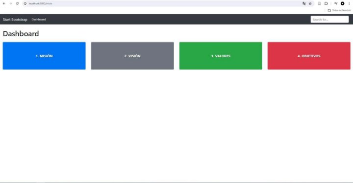
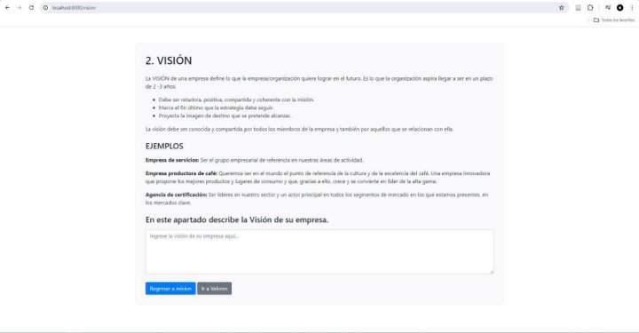
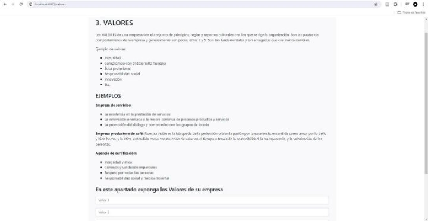

INTELIGENCIA ARTIFICIAL - UNIDAD II 

**INFORME DE AVANCE DE PROYECTO PETI** 

Docente: Dr. Oscar Jimenez Flores 

|Título del proyecto |**Municipalidad Distrital Crnl. Gregorio Albarracín  Lanchipa (MD-CGAL)** |Fecha |**23/05/2024** |
| - | :- | - | - |

|Integrante |Código de estudiante |Correo electrónico |Rol o Función |
| - | - | - | - |
|Ccalli Chata, Joel Robert |2017057528 |jc2017057528@virtual.upt.pe |Programador |
|Llantay Machaca, Marjiory Grace |2020068951 |ml2020068951@virtual.upt.pe |Programador |
|Ticahuanca Fiorela Milady |2020068765|ft2020068765@virtual.upt.pe |Programador |
|Apaza Mamani, Edward Hernán |2018060915 |ft2020068765@virtual.upt.pe |Programador |

ESTADO DEL PROYECTO ESTA SEMANA 

|Número de avance |Segundo avance |
| - | - |
|URL Github |https://github.com/edwardapaza/Proyecto\_Peti |
|% de Avance |30% |

RESUMEN 

Ingrese información aquí sobre el estado general y los aspectos más destacados del avance del proyecto en esta semana. 

Diseño y Desarrollo del Sistema: Hemos diseñado y desarrollado un sistema basado en Python para facilitar la gestión eficiente del registro de usuarios y otras actividades administrativas. Este sistema se centra en la creación, lectura, actualización y eliminación (CRUD) de registros, así como en la gestión de tareas administrativas cruciales para la Municipalidad. 

Consideraciones Técnicas y Funcionales: A lo largo del proceso, hemos tenido en cuenta tanto las consideraciones técnicas como las funcionales para garantizar un sistema robusto y fácil de usar. Nos hemos enfocado en la agilización de los procesos internos, la mejora de la transparencia y accesibilidad de la información, y la optimización de la eficiencia en la gestión.

Primer Avance: 

2do Avance: 

TRABAJO REALIZADO 

|**Tarea N°** |**Descripción de las actividades realizadas** |**Responsable** |
| :- | - | - |
|1 |Monitoreo y Soporte de Mantenimiento |Joel Ccalli |
|2 |Diseño de Arquitectura de Sistema |Marjiori Llantay |
|3 |Implementación de Funcionalidad de CRUD |Edward Apaza |
|4 |Despliegue de Sistema y Comprobación de Errores |Fiorella Midaly Ticahuanca |

